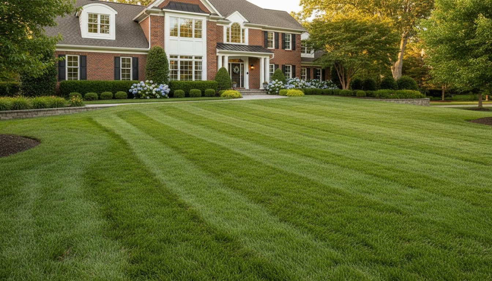

# 🌿 Jacob's Lawn Care Doctors

A premium, modern landscaping website for Newport News, VA with smooth scroll animations, quote forms, and full mobile responsiveness.



## ✨ Features

- 🎨 **Premium Design** - Deep forest green & gold color palette
- 📱 **Fully Responsive** - Works perfectly on mobile, tablet, desktop
- ✨ **Smooth Animations** - GSAP scroll-triggered animations
- 📝 **Quote Form** - Integrated contact form in hero section
- 🖼️ **Gallery Section** - Accordion-style services showcase
- ⚡ **Fast Performance** - Vite + React optimized build
- 🔒 **SSL Ready** - HTTPS enabled

## 🚀 Quick Deploy Options

### Option 1: Vercel (Recommended - 1 Click)

1. **Push to GitHub first:**
   ```bash
   # Create a new GitHub repo named "jacobs-lawn-care-doctors"
   # Then run these commands:
   git init
   git add .
   git commit -m "Initial commit"
   git branch -M main
   git remote add origin https://github.com/YOUR_USERNAME/jacobs-lawn-care-doctors.git
   git push -u origin main
   ```

2. **Deploy to Vercel:**
   - Go to [vercel.com/new](https://vercel.com/new)
   - Import your GitHub repository
   - Click **Deploy**
   - Done! 🎉

### Option 2: Netlify (Drag & Drop)

1. **Build the project:**
   ```bash
   npm run build
   ```

2. **Go to [netlify.com](https://netlify.com)**

3. **Drag the `dist` folder** onto the dashboard

4. **Your site is live instantly!**

### Option 3: Command Line

```bash
# Install Vercel CLI (one time)
npm install -g vercel

# Login to Vercel (one time)
vercel login

# Deploy
npm run deploy
```

## 📁 Project Structure

```
├── public/              # Static images & assets
│   ├── hero_lawn_house.jpg
│   ├── garden_flowers_wide.jpg
│   └── ... (12 total images)
├── src/
│   ├── components/      # Navigation, Footer
│   ├── sections/        # Hero, Services, etc.
│   ├── App.tsx          # Main app component
│   └── index.css        # Global styles
├── dist/                # Built files (auto-generated)
├── vercel.json          # Vercel configuration
├── package.json         # Dependencies
└── DEPLOY.md            # Detailed deployment guide
```

## 🛠️ Local Development

```bash
# Install dependencies
npm install

# Start dev server
npm run dev

# Build for production
npm run build

# Preview production build
npm run preview
```

## 🌐 Custom Domain Setup

### Vercel:
1. Go to Project Settings → Domains
2. Add your domain (e.g., `jacobslawncare.com`)
3. Update DNS records as instructed
4. SSL certificate is automatic!

### Netlify:
1. Site Settings → Domain Management
2. Add custom domain
3. Configure DNS

## 📊 Website Sections

1. **Hero** - Headline + Quote Form
2. **Curb Appeal** - Full-bleed statement
3. **We're Local** - Trust card
4. **Residential Specialists** - Target audience
5. **Easy Booking** - Process highlight
6. **Dependable** - Reliability message
7. **Satisfaction** - Guarantee
8. **Services** - 25+ services in accordion
9. **Footer** - Contact info & links

## 🎨 Color Palette

| Color | Hex | Usage |
|-------|-----|-------|
| Forest Green | `#0B3A2E` | Primary background |
| Sage White | `#F4F7F5` | Light sections |
| Antique Gold | `#D9A84A` | Accents, CTAs |
| Cream | `#F6F7F5` | Text |

## 🔧 Tech Stack

- **Framework:** React + Vite
- **Styling:** Tailwind CSS
- **Animations:** GSAP + ScrollTrigger
- **Icons:** Lucide React
- **Fonts:** Cormorant Garamond + Inter

## 📱 Mobile Optimized

- Touch-friendly navigation
- Responsive typography
- Sticky call button
- Accordion services menu
- Optimized images

## 🆘 Need Help?

- **Vercel Docs:** [vercel.com/docs](https://vercel.com/docs)
- **React Docs:** [react.dev](https://react.dev)
- **Tailwind Docs:** [tailwindcss.com](https://tailwindcss.com)

## 📄 License

Private - For Jacob's Lawn Care Doctors

---

**Built with ❤️ for Newport News, VA**
